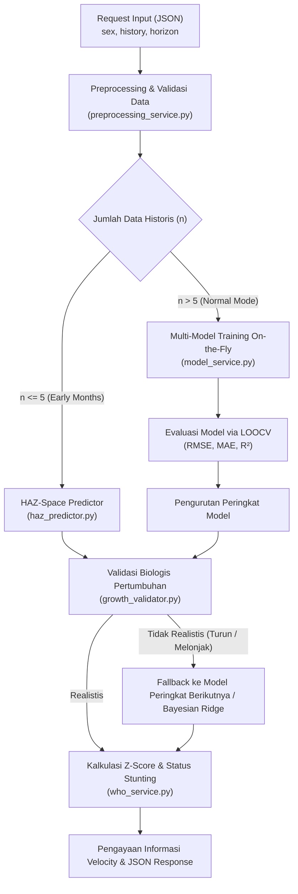

# Cara Kerja Model AI Antropometri (SiKecil ML)

Dokumen ini menjelaskan secara teknis dan mendalam bagaimana sistem AI pada aplikasi **SiKecil ML** bekerja, mulai dari penerimaan data mentah dari pengguna hingga menghasilkan prediksi tinggi badan dan klasifikasi status stunting berdasarkan standar **WHO (World Health Organization)**.

---

## 💡 Konsep Utama: Smart Hybrid System

Aplikasi ini menggunakan pendekatan **Smart Hybrid System**, yaitu mengombinasikan:
1. **Machine Learning (Data-Driven)**: Mempelajari pola pertumbuhan individu balita dari data historis pengukuran yang diberikan.
2. **Pengetahuan Medis Standar WHO (Domain Knowledge)**: Memastikan prediksi tidak menyimpang dari batas biologis manusia dan mengomputasi *Z-score* standar kesehatan balita.

---

## 🔄 Diagram Alur Kerja (Flowchart)



---

## 🛠️ Detail Langkah demi Langkah

### 1. Menerima Request Input (HTTP Endpoint)
Pengguna atau aplikasi klien mengirimkan data pengukuran balita melalui endpoint REST API:
* **Endpoint Active**: `POST /api/predict` (v2) dan `POST /api/predict/v3`
* **File Terkait**: [`routes/prediction_route.py`](file:///c:/Users/Rayhan%20BE/Desktop/antropometri-project/new/sikecil-ml/routes/prediction_route.py), [`routes/prediction_route_v3.py`](file:///c:/Users/Rayhan%20BE/Desktop/antropometri-project/new/sikecil-ml/routes/prediction_route_v3.py)

**Contoh Payload JSON Input:**
```json
{
  "sex": "L",
  "horizon": 6,
  "history": [
    { "age": 0, "height": 49.5 },
    { "age": 2, "height": 58.4 },
    { "age": 4, "height": 63.9 },
    { "age": 6, "height": 67.6 }
  ]
}
```

---

### 2. Preprocessing & Ekstraksi Fitur
Fungsi `build_feature` pada [`services/preprocessing_service.py`](file:///c:/Users/Rayhan%20BE/Desktop/antropometri-project/new/sikecil-ml/services/preprocessing_service.py) bertugas:
* **Validasi Struktur**: Memastikan field wajib (`sex`, `history`, `age`, `height`) terisi dengan tipe data yang benar.
* **Pengurutan (Sorting)**: Mengurutkan riwayat berdasarkan usia (`age`) secara menaik (*ascending*).
* **Ekstraksi Matriks**: Mengubah array JSON menjadi matriks fitur $X$ (array 2D usia dalam bulan) dan array target $y$ (tinggi badan dalam cm).

---

### 3. Pemilihan Mode & Pelatihan Model (*On-the-Fly*)
Aplikasi tidak menggunakan satu model statis yang sudah di-fit secara global, melainkan melatih model secara *real-time* khusus untuk balita tersebut:

#### A. Mode *Early Months* ($n \le 5$ titik data)
Jika data balita masih sangat sedikit ($n \le 5$), model regresi linier/non-linier murni rentan mengalami *overfitting* atau proyeksi liar.
* **Modul**: [`services/haz_predictor.py`](file:///c:/Users/Rayhan%20BE/Desktop/antropometri-project/new/sikecil-ml/services/haz_predictor.py)
* **Mekanisme**: Data tinggi dikonversi dulu ke ruang **HAZ (Height-for-Age Z-score WHO)**. Tren HAZ diprediksi menggunakan strategi *Dampened Trend* / *Mean Reversion* atau *Bayesian Ridge*, lalu dikonversi kembali ke nilai tinggi (cm).

#### B. Mode *Normal / Multi-Model* ($n > 5$ titik data)
Pada [`services/model_service.py`](file:///c:/Users/Rayhan%20BE/Desktop/antropometri-project/new/sikecil-ml/services/model_service.py), sistem melatih beberapa arsitektur model sekaligus:
1. **Bayesian Ridge Regression**: Model regresi linier berparameter Bayesian dengan regularisasi otomatis.
2. **Gompertz Growth Model**: Model pertumbuhan biologis non-linier ber-asimptot (bentuk kurva S):
   $$f(x) = A \cdot \exp(-B \cdot \exp(-C \cdot x))$$
3. **Von Bertalanffy Growth Model**: Model pertumbuhan fisik berbasis laju metabolisme:
   $$f(x) = A - B \cdot \exp(-K \cdot x)$$
4. **Gaussian Process Regression (GPR) + WHO Median Prior** (Endpoint v3):
   * Menghitung deviasi individu dari median WHO: $y_{\text{dev}} = y_{\text{aktual}} - y_{\text{WHO\_median}}$
   * Memprediksi deviasi masa depan dengan GPR dan menambahkan kembali median WHO.
   * Menghasilkan **Uncertainty Band** (interval kepercayaan 95%).

---

### 4. Evaluasi & Pemilihan Model Terbaik
Fungsi `evaluate_models` pada [`services/model_service.py`](file:///c:/Users/Rayhan%20BE/Desktop/antropometri-project/new/sikecil-ml/services/model_service.py) mengevaluasi performa tiap model menggunakan metode **Leave-One-Out Cross-Validation (LOOCV)**:
* Metrik evaluasi yang dihitung:
  * **RMSE** (*Root Mean Squared Error*)
  * **MAE** (*Mean Absolute Error*)
  * **$R^2$** (*Coefficient of Determination*)
* Model diurutkan berdasarkan **RMSE terkecil** (tingkat presisi tertinggi).

---

### 5. Validasi Biologis (*Growth Velocity Check*)
Model dengan error terendah tidak langsung digunakan secara mentah. Fungsi `is_growth_realistic` pada [`services/growth_validator.py`](file:///c:/Users/Rayhan%20BE/Desktop/antropometri-project/new/sikecil-ml/services/growth_validator.py) menguji kewajaran hasil prediksi:
1. **Monotonisitas (Tinggi Tidak Boleh Turun)**:
   $$\Delta \text{tinggi} = \text{height}_{t+1} - \text{height}_t \ge -0.1\text{ cm}$$
2. **Laju Pertumbuhan (Velocity Ratio)**:
   Kecepatan pertambahan tinggi dibandingkan dengan *expected growth velocity* populasi WHO. Jika pertambahan tinggi > 2.5x kecepatan rata-rata WHO, prediksi dianggap tidak masuk akal (terlalu melonjak).

> ⚠️ **Mekanisme Fallback**: Jika model terbaik #1 gagal dalam pengujian biologis, sistem otomatis pindah ke model terbaik #2, dan seterusnya. Jika semua gagal, sistem menggunakan Bayesian Ridge sebagai *safety net*.

---

### 6. Kalkulasi Z-score & Klasifikasi Status WHO
Setelah trajectory tinggi badan yang realistis terpilih, [`services/who_service.py`](file:///c:/Users/Rayhan%20BE/Desktop/antropometri-project/new/sikecil-ml/services/who_service.py) mencocokkan hasil prediksi tiap bulan dengan **Tabel LMS WHO** (`data/who_lms.csv`).

**Formula LMS WHO:**
$$Z = \begin{cases} \frac{\ln(y / M)}{S} & \text{jika } |L| < 10^{-8} \\ \frac{(y / M)^L - 1}{L \cdot S} & \text{jika } |L| \ge 10^{-8} \end{cases}$$

Keterangan:
* $y$: Tinggi badan hasil prediksi (cm)
* $L$: Parameter *Box-Cox Skewness* WHO
* $M$: Median tinggi badan populasi WHO (cm)
* $S$: *Coefficient of Variation* WHO

**Klasifikasi Status Stunting (HAZ):**
* $\text{HAZ} < -3$: **Severely Stunted** (Stunting Berat)
* $-3 \le \text{HAZ} < -2$: **Stunted** (Stunting)
* $-2 \le \text{HAZ} < -1$: **At Risk** (Beresiko Stunting)
* $\text{HAZ} \ge -1$: **Normal**

---

### 7. Respon Akhir JSON
Sistem menambahkan informasi `growth_velocity` (cm/bulan), `expected_velocity`, dan `velocity_ratio` ke dalam respons JSON:

```json
{
  "success": true,
  "selected_model": "Gompertz",
  "prediction_mode": "normal",
  "n_history": 4,
  "metrics": {
    "Gompertz": { "mae": 0.12, "rmse": 0.15, "r2": 0.99 },
    "Bayesian Ridge": { "mae": 0.28, "rmse": 0.32, "r2": 0.97 }
  },
  "prediction": [
    {
      "age": 7,
      "height": 69.4,
      "haz": -0.25,
      "status": "Normal",
      "growth_velocity": 1.8,
      "expected_velocity": 1.4,
      "velocity_ratio": 1.29
    }
  ]
}
```

---

## 📁 Struktur Berkas Terkait

* [`app.py`](file:///c:/Users/Rayhan%20BE/Desktop/antropometri-project/new/sikecil-ml/app.py) — Inisialisasi Flask Server & Routing Blueprint.
* [`routes/prediction_route.py`](file:///c:/Users/Rayhan%20BE/Desktop/antropometri-project/new/sikecil-ml/routes/prediction_route.py) — Controller Endpoint v2 `/api/predict`.
* [`routes/prediction_route_v3.py`](file:///c:/Users/Rayhan%20BE/Desktop/antropometri-project/new/sikecil-ml/routes/prediction_route_v3.py) — Controller Endpoint v3 `/api/predict/v3` (Multi-indikator & GPR + WHO Prior).
* [`services/preprocessing_service.py`](file:///c:/Users/Rayhan%20BE/Desktop/antropometri-project/new/sikecil-ml/services/preprocessing_service.py) — Parser data historis & pembentuk fitur $X, y$.
* [`services/model_service.py`](file:///c:/Users/Rayhan%20BE/Desktop/antropometri-project/new/sikecil-ml/services/model_service.py) — Trainer & Evaluator Multi-Model (Gompertz, Von Bertalanffy, Bayesian Ridge, GPR).
* [`services/haz_predictor.py`](file:///c:/Users/Rayhan%20BE/Desktop/antropometri-project/new/sikecil-ml/services/haz_predictor.py) — Predictor khusus untuk sampel sedikit ($n \le 5$).
* [`services/growth_validator.py`](file:///c:/Users/Rayhan%20BE/Desktop/antropometri-project/new/sikecil-ml/services/growth_validator.py) — Validator biologis kurva pertumbuhan.
* [`services/who_service.py`](file:///c:/Users/Rayhan%20BE/Desktop/antropometri-project/new/sikecil-ml/services/who_service.py) — Kalkulator Z-Score LMS WHO & Klasifikasi Status.
